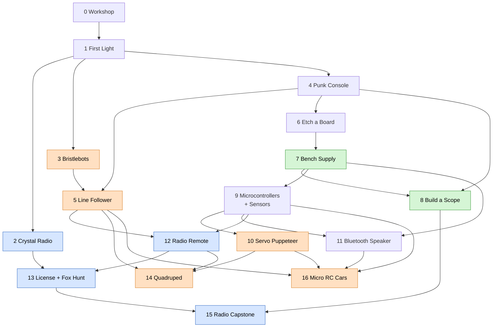

# Family Electronics Workshop

**Website:** <https://electrolab.wyattfry.com>

A sequenced, build-it-yourself electronics course for a parent and two kids (ages 8 and 11
at the start, fall 2026).

- It starts with first solder joints and builds up to:
  - robots
  - our own test gear
  - a Bluetooth speaker that holds its own against a $75 store-bought one
  - radio remote control
  - ham radio
- We fabricate as much as possible ourselves, including home-etched boards and wooden
  enclosures.

No single book or website already does this whole arc, so this repo stitches together the
best existing resources (see [resources.md](resources.md)) with our own projects.

## How to use this

- **One unit at a time, roughly in order.** Each unit teaches the skills the next one needs
  (see the map). Skipping ahead is fine for a unit that grabs someone, but come back.
- **Sessions are 60 to 90 minutes.** Stop while it's still fun. Every unit lists rough
  session counts.
- **Every unit has two tracks.** The **8 y.o. track** and the **11 y.o. track** build the
  same thing with different jobs. The parent is the safety officer and the "senior engineer".
- **Keep a build log.** Copy [templates/build-log.md](templates/build-log.md) into the unit
  folder: photos, what broke, what we learned. Debugging stories are the best part.
- **Earn badges.** Each unit awards skill badges from the
  [skill ladder](00-workshop/skill-ladder.md). They're worth making physical, e.g. stickers
  on the toolbox.

## The units

| # | Unit | What we build | New skills | Sessions |
|---|---|---|---|---|
| 0 | [Workshop](00-workshop/README.md) | Bench, tools, safety rules | Iron handling, safety | 1 |
| 1 | [First Light](units/01-first-light/README.md) | Practice board, then a two-transistor LED blinker | Through-hole soldering, polarity, schematics | 2–3 |
| 2 | [Crystal Radio](units/02-crystal-radio/README.md) | AM radio with no battery | Coils, tuning, antennas, resonance | 2 |
| 3 | [Bristlebots](units/03-bristlebots/README.md) | Vibration robots and a racing arena | Wire soldering, motors, first robots | 1–2 |
| 4 | [Punk Console](units/04-punk-console/README.md) | Two-555 noise synth in a tin | ICs, sockets, pots, audio | 3 |
| 5 | [Line Follower](units/05-line-follower/README.md) | Analog line-following robot, no code | Sensors, comparators, MOSFETs | 4–5 |
| 6 | [Etch a Board](units/06-etch-a-board/README.md) | Our own PCB (a Punk Console v2) | KiCad, toner transfer, etching | 3–4 |
| 7 | [Bench Supply](units/07-bench-supply/README.md) | Adjustable CC/CV lab supply | Regulators, current limiting, heat | 4–5 |
| 8 | [Build a Scope](units/08-scope/README.md) | DSO138 kit oscilloscope (+ Pico scope) | Seeing signals, calibration | 3–4 |
| 9 | [Microcontrollers and Sensors](units/09-microcontrollers/README.md) | Pico: songs, motion alarm, ultrasonic ruler, servo, LCD, **Sentry** | Programming, PWM, I2C, sensors | 6–8 |
| 10 | [Servo Puppeteer](units/10-servo-puppeteer/README.md) | 555 servo tester, then pot-controlled servos with record and playback, then a **waldo** for the quadruped leg | Servo signals, ADC, kinematics | 4–6 |
| 11 | [Bluetooth Speaker](units/11-bluetooth-speaker/README.md) | Battery ESP32 stereo speaker in a wood box | Digital audio, Li-ion, enclosures, SMD | 6–8 |
| 12 | [Radio Remote](units/12-radio-remote/README.md) | SDR safari, the DTMF → smart plug bridge, a radio-controlled robot | SDR, DTMF, radio rules | 5–6 |
| 13 | [License + Fox Hunt](units/13-fox-hunt/README.md) | Technician licenses, a tape-measure Yagi, a fox transmitter | RF, direction finding, FCC rules | 6+ |
| 14 | [Quadruped](units/14-quadruped/README.md) | Finish the `legv2` walking robot (a separate family repo, not public yet) | Linkages, calibration, gaits | 6+ |
| 15 | [Radio Capstone](units/15-radio-capstone/README.md) | Kit HF transceiver or a homebrew SA818 handheld | Transceivers, test equipment | 6–10 |
| 16 | [Micro RC Cars](units/16-micro-rc-cars/README.md) | LEGO Technic RC car per kid (rack-and-pinion steering, differential) with a **wireless charging garage**, a homebuilt controller, lights, a distance sensor, a camera, and self-driving | ESP-NOW, power paths, Qi charging, modular design | 10–14 |

## The map

Arrows mean "teaches skills used by". Robots are orange, test gear is green, radio is blue.



**Threads that run through the course:**

- **Robots:**
  1. Bristlebots (3)
  2. Line follower (5)
  3. Sentry (9)
  4. Servo puppets (10)
  5. Radio-controlled robot (12)
  6. The quadruped, which walks and gets radio control (14)
  7. RC cars that charge themselves and drive themselves (16)
- **The 555 timer:** blinker-style (1), synth (4), PWM for the line follower (5), servo
  tester (10).
- **Radio:** crystal radio (2), SDR and the DTMF bridge (12), licenses and the fox hunt
  (13), a radio we built (15).

## Diagrams

**Schematics** are drawn in Python with [schemdraw](https://schemdraw.readthedocs.io) and
committed as SVG next to the unit (`units/NN-*/<name>.py` → `<name>.svg`), so they render
on GitHub and in VS Code.

**Block diagrams and flows** are [Mermaid](https://mermaid.js.org) code blocks, which
GitHub renders natively.

To regenerate every schematic after editing a `.py`:

```sh
python3 -m venv .venv && .venv/bin/pip install -r requirements.txt   # once
tools/build_diagrams.sh
```

## Layout

```
README.md               this file
resources.md            books, kits, sites, suppliers
00-workshop/            bench setup, tool list, safety rules, skill ladder
units/NN-name/          one folder per unit: README.md, schematics (.py → .svg), code/, firmware/
templates/              unit template and build-log template
tools/                  diagram build and render-check scripts
```

## Status

- [ ] 0 Workshop set up
- [ ] 1 First Light
- [ ] 2 Crystal Radio
- [ ] 3 Bristlebots
- [ ] 4 Punk Console
- [ ] 5 Line Follower
- [ ] 6 Etch a Board
- [ ] 7 Bench Supply
- [ ] 8 Build a Scope
- [ ] 9 Microcontrollers and Sensors
- [ ] 10 Servo Puppeteer
- [ ] 11 Bluetooth Speaker
- [ ] 12 Radio Remote (the parent's DTMF bridge already works: `~/infra/radio`)
- [ ] 13 License + Fox Hunt
- [ ] 14 Quadruped (already in progress in `~/legv2`)
- [ ] 15 Radio Capstone
- [ ] 16 Micro RC Cars (can start any time after Unit 11)
