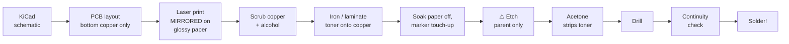

# Unit 6: Etch a Board

> Design a circuit board on the computer, print it, iron it onto copper, and dissolve away
> everything that isn't a wire. Then build the Punk Console again, on OUR board.

**Sessions:** 3–4 · **Cost:** ~$30 in materials · **Badges:** (new) 🏭 Board Maker
**Prerequisites:** Unit 4

## What we're building

A single-sided PCB for the Unit 4 Punk Console, designed in KiCad and fabricated at home by
toner transfer.

- **8 y.o.:** designs the **artwork**, e.g. their name and a drawing made of copper.
- **11 y.o.:** does the schematic capture and routing.

## Process at a glance

## Parts and materials

| Item | Notes |
|---|---|
| Single-sided FR-4 copper clad, 1 oz | 10×10 cm sheets |
| Glossy paper | Magazine pages, or "toner transfer paper" |
| Laser printer | **Must be toner**, not inkjet |
| Clothes iron (no steam) or a modified laminator | A laminator is much more repeatable |
| Etchant: **ferric chloride** or **sodium persulfate** | Persulfate is clear, so you can watch the copper vanish |
| Plastic tray, plastic tongs, nitrile gloves, goggles | |
| Scotch-Brite pad, isopropyl alcohol, acetone | |
| 0.8 mm and 1.0 mm drill bits (carbide), drill press or Dremel press stand | Carbide bits snap if you drill by hand |
| Fine-tip permanent marker | For touch-ups |

## ⚠️ Chemical safety: the parent handles the etchant

- Goggles and gloves on everyone near the tray. Work in a ventilated area or outdoors.
- **Ferric chloride stains everything permanently** and irritates skin. Use a plastic tray,
  and put newspaper under it.
- We **don't** use the HCl + hydrogen peroxide etch at home with kids. It's faster, but
  produces chlorine gas and is much more hazardous.
- **Disposal:** used etchant is full of dissolved copper, which is toxic to aquatic life.
  **Never pour it down the drain.** Take it to household hazardous waste.
- Kids can watch, time it and agitate the tray with tongs.

## Design rules for home etching

| Rule | Value | Why |
|---|---|---|
| Trace width | ≥ 0.6 mm signal, ≥ 1.0 mm power | Toner transfer loses fine detail |
| Clearance | ≥ 0.5 mm | Avoids bridges |
| Pad size (DIP) | 2.0 mm round, 0.8 mm hole | A big ring survives drilling |
| Copper fill | Ground pour on unused area | Less copper to etch, so it's faster |
| Text | ≥ 1.5 mm tall, 0.3 mm stroke | For the name and art |

## Steps

### Session 1: KiCad (11 y.o. leads)

1. Enter the Unit 4 schematic in KiCad.
2. Assign footprints: DIP-8 sockets, and off-board pads for the pots and jack, connected by
   wires.
3. Lay out the board, 5×5 cm or smaller. Route everything on the bottom (B.Cu) layer only.
4. **8 y.o.:** draw the artwork, e.g. with KiCad's Image Converter or hand-drawn graphic
   lines on B.Cu.
5. Plot B.Cu at 1:1, **mirrored**, black only. Print a test page on plain paper and set the
   real parts on it to check the footprints fit.

### Session 2: transfer and etch (the parent handles chemicals)

1. Scrub the copper with Scotch-Brite until bright, then wipe with alcohol. Don't touch the
   copper afterwards.
2. Place the print toner-down on the copper.
   - **Iron:** max heat, press hard for 3–5 minutes, working the whole surface.
   - **Laminator:** 5–10 passes.
3. Soak in warm water for 10 minutes and rub the paper off gently with a thumb.
4. Inspect, and fix any breaks with the marker.
5. Etch.
   - **Ferric chloride:** warm, agitated, about 10–20 minutes.
   - **Sodium persulfate:** needs to be warm (about 45 °C).
   - Pull it out when all the exposed copper is gone. Rinse well.
6. Remove the toner with acetone.

### Session 3: drill and build

1. Drill with a drill press or Dremel stand. The 11 y.o. drills with supervision; the
   8 y.o. works the vacuum.
2. Continuity-check every trace against the net list **before** soldering.
   → **Continuity Detective**.
3. Solder the Punk Console v2. Compare it with the perfboard version.

## Troubleshooting

| Problem | Cause | Fix |
|---|---|---|
| Toner doesn't stick | Copper greasy or oxidized; not enough heat | Re-scrub; more heat and pressure |
| Traces pitted or broken | Transfer gaps | Marker touch-up before etching |
| Etches unevenly | No agitation, or cold etchant | Rock the tray; warm the bath in a water bath |
| Pads torn off when drilling | Pads too small; dull bit | Bigger pads; new bit; peck drill slowly |

## Level-ups

- **UV dry-film photoresist:** finer traces (down to about 0.3 mm), and more repeatable.
- **CNC isolation milling** with a 3018 router. There are no chemicals, but it makes
  fiberglass dust (use a vacuum and a mask).
- **Two-sided board** with via rivets.
- **Compare:** send the same design to JLCPCB (about $5) and compare quality, time and cost.
  Discuss when DIY makes sense.
