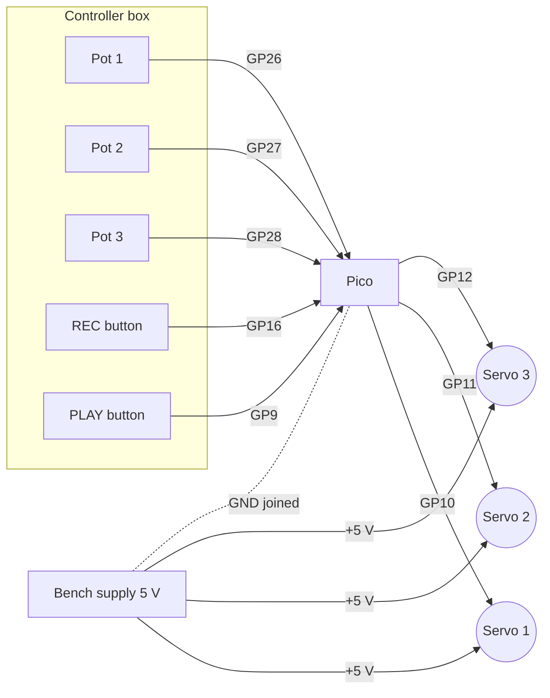

# Unit 10: Servo Puppeteer

> Turn a knob, and a servo follows. Then record a dance and play it back. Then build a
> little copy of the robot leg: move the copy with your hand, and the real leg copies you.

**Sessions:** 4–6 · **Cost:** ~$20 · **Badges:** Coder, Schematic Reader, (new) 🦾 Puppeteer
**Prerequisites:** Units 4 and 9

Three stages. Each one stands alone, and each teaches what the next one builds on.

| Stage | What | Brains | Teaches |
|---|---|---|---|
| **A** | 555 servo tester | None: one 555 chip | What a servo signal *is* |
| **B** | 3 pots → 3 servos, plus record and playback | Pico | ADC, mapping, smoothing, lists as memory |
| **C** | **Waldo:** a replica leg with pots at its joints drives the real `~/legv2` leg | Pico | Joint angles vs servo angles, calibration, coupling |

## How servos work (kid version)

- A servo listens for a pulse every 20 ms (50 times a second).
- The **length** of the pulse says where to point:
  - 0.5 ms = all the way one way
  - 1.5 ms = middle
  - 2.5 ms = all the way the other way
- Inside is a motor, gears, and a knob (a pot!) that tells the servo where it is. The servo
  keeps turning until its knob matches the pulse. **Our controller is a pot talking to the
  servo's pot.**

---

## Stage A: the 555 servo tester (no code)

The Unit 4 chip again, as an astable with **diode steering**, so the high time and the low
time are set separately.


**How the timing works:**

| Phase | Current path | Time |
|---|---|---|
| **Charge** (output high = the pulse) | Vcc → R_A (10 kΩ + 22 kΩ pot) → pin 7 → D1 → C | t_H ≈ 0.693 · (10k…32k) · 100 nF ≈ **0.7–2.2 ms** |
| **Discharge** (output low) | C → R_B (270 kΩ) → pin 7 → ground. D1 is reverse-biased. | t_L ≈ 0.693 · 270k · 100 nF ≈ **18.7 ms** |

That gives a period of about 20 ms, or 50 Hz, which is what servos want. The diode drop
stretches t_H a little, so trim with the pot.

We deliberately stop at 0.7–2.2 ms rather than 0.5–2.5 ms, so a cheap servo never gets
driven into its end stop.

### Parts

| Qty | Part |
|---|---|
| 1 | NE555 and a socket |
| 1 | 10 kΩ, 1 × 270 kΩ resistor |
| 1 | 22 kΩ linear pot (B22K), with a knob |
| 1 | 1N4148 diode |
| 1 | 100 nF film or ceramic (timing), 10 nF (pin 5), 100 µF (supply) |
| 1 | 3-pin male header for the servo plug |
| 1 | 4×AA holder (≈ 6 V) or the bench supply at 5 V |

### Jobs

| Step | 8 y.o. | 11 y.o. | Parent |
|---|---|---|---|
| Breadboard | Plugs in the servo and turns the knob | Builds it from the schematic | Check before power |
| Scope it (Unit 8) | Watches the pulse get wider | Measures t_H at both pot ends and t_L | |
| Solder onto perfboard | Solders the header and battery leads | Everything else | |

**Keep it in the toolbox.** A servo tester is how you check any servo before putting it in
a robot: center it before you attach the horn.

---

## Stage B: Pico puppeteer, 3 pots → 3 servos



| Pico pin | Connects to |
|---|---|
| GP26 / GP27 / GP28 (ADC0–2) | Pot wipers. Pot ends go to **3V3** and **GND**, never 5 V. |
| GP10 / GP11 / GP12 | Servo signals |
| GP16 | **Record** button (to GND) |
| GP9 | **Play** button (to GND) |
| GP13 | Red LED (recording) |
| — | Servo power from the bench supply at 5 V. **Join the grounds.** |

The Pico has only 3 ADC pins we can use (ADC3 watches its own supply), so there are 3 pots.
For more, add an ADS1115 or a 4051 multiplexer. That's a level-up.

**Code:** [`code/puppet.py`](code/puppet.py). It needs [`../09-microcontrollers/code/servo.py`](../09-microcontrollers/code/servo.py)'s
ideas, but it's self-contained.

- **Smoothing:** the ADC is noisy, so we low-pass filter it:
  `smooth += (raw - smooth) * 0.2`.
- **Deadband:** only move the servo when the target changes by at least 1°. No jitter.
- **Record:** hold the record button and every 20 ms the three angles get appended to a
  list. Release to stop.
- **Play:** press play and the list replays in a loop. Press it again to stop.

### Build ideas

- **Robot arm:** 3 servos: base, shoulder, claw. Build it from popsicle sticks, cardboard, or
  a 3D print.
- **Puppet show:** a cardboard character whose head turns and whose mouth opens. Record the
  "performance", then play it back while the kids do the voices.
- **Controller box:** solder the pots and buttons into a box with big knobs. The 8 y.o.
  designs and labels the panel.

### Jobs

| Step | 8 y.o. | 11 y.o. | Parent |
|---|---|---|---|
| Wire the pots | Plugs them in; turns them while watching the Shell print numbers | Maps 0–65535 → degrees | |
| Build the arm or puppet | Designs and builds it | Mounts the servos | Hot glue, cutting |
| Record a routine | Performs it | Adds a "speed" knob for playback | |
| Controller box | Panel art and labels | Solders it | Drills it |

---

## Stage C: the Waldo (drives the real quadruped leg)

A **waldo** is a small replica that you move by hand, and the real machine copies it. The
name comes from a 1942 sci-fi story.

1. **Build the replica** at 1:1 from the leg geometry in `~/legv2`.
   - Thigh 30 mm and calf 63–84 mm, joint to joint. See `~/legv2/README.md`; the calf
     length is still being settled.
   - Cardboard or plywood, with a **pot shaft as each joint**: the hip pot fixed to a base,
     and the knee pot on the end of the thigh.
   - The 8 y.o. can build most of this.
2. **The key idea: a joint angle is not a servo angle.**
   - The real leg's knee is driven *through a linkage*. From `~/legv2/calibration/cal_ch23.json`,
     counting every angle as degrees moved from the zero pose:
     ```
     d_thigh = -0.936 × d_hip_servo
     d_calf  = -0.700 × d_knee_servo  +  -0.111 × d_hip_servo     ← coupling!
     ```
   - The waldo's pots measure the thigh and the knee. To make the real leg match, solve for
     the servo angles:
     ```
     d_hip_servo  = d_thigh / -0.936
     d_knee_servo = (d_calf - (-0.111 × d_hip_servo)) / -0.700
     ```
   - **A catch** (the 11 y.o. and parent investigate this together):
     - The calibration measured the calf's **absolute** angle in the camera image.
     - The waldo's knee pot measures the **relative** angle (calf vs thigh).
     - So `d_calf = d_thigh + d_knee`, unless the camera's sign convention flips it.
       `waldo.py` has a `CALF_IS_ABSOLUTE` switch. Test both, and record which one is
       right in the build log.
   - This is the 11 y.o.'s big math moment: *why does moving the hip make the knee move
     too, and how do we cancel it?*
3. **Zeroing:** put the waldo and the real leg in the same pose (the starting pose template,
   `~/legv2/starting_pose_1to1.pdf`, printed 1:1) and press the button. Everything after
   that is measured relative to the zero.
4. **Wiring:**
   - For the waldo session, unplug the leg's two servos from the Pi's PCA9685 HAT and plug
     them into the Pico (GP10 = hip, GP11 = knee).
   - `legs.py` on the Pi has no joint-pose endpoint yet. Adding `POST /api/pose` would let
     the Pico W drive the leg over WiFi instead. That's a good 11 y.o. + parent task later.

**Code:** [`code/waldo.py`](code/waldo.py). The gains at the top come from the measured
ch2/ch3 calibration.

> ⚠️ The ch0/ch1 leg is **not calibrated** (see `~/legv2/README.md`). Use the ch2/ch3 leg
> for the waldo, or measure ch0/ch1 first.

### Jobs

| Step | 8 y.o. | 11 y.o. | Parent |
|---|---|---|---|
| Build the replica | Cuts, glues, mounts the pots | Measures the lengths against the real leg | |
| The coupling math | "Why does the foot wiggle when only the hip moves?" | Derives the servo equations from the gains | Explains the linkage |
| Tuning | Moves the waldo | Adjusts the gains and limits | Watches for binding and stalls |

## Troubleshooting

| Symptom | Likely cause | Check |
|---|---|---|
| Servo jitters constantly | Noisy ADC or supply sag | Smoothing, deadband, 100 µF+ across the servo supply |
| Pico resets when servos move | Servos powered from the Pico | Separate supply, joined grounds |
| Servo buzzes and gets hot at one end | Pulse past the servo's mechanical stop | Narrow MIN_US/MAX_US or the angle limits |
| Pot reading jumps near the ends | Cheap pot, worn track | Use the middle of the pot's range |
| Waldo and real leg drift apart | Wrong zero, or a gain sign flipped | Re-zero at the template pose; check signs |

## Talk about it

- The servo has a pot inside, and we're controlling it with a pot. What's the servo
  actually doing?
- Why does the real leg need different angles than the waldo, if they look the same?
