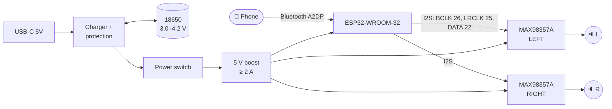

# Unit 11: Bluetooth Speaker

> A rechargeable stereo Bluetooth speaker in a wooden box we built, tuned to sound as good
> as a $75 store-bought one.

**Sessions:** 6–8 · **Cost:** ~$70–90 · **Badges:** Tiny Parts, Heat Manager (for the Li-ion safety talk), (new) 🔊 Sound Engineer
**Prerequisites:** Units 7 and 9 (and 6 if we etch the carrier board)

## What we're building

| Block | Choice | Why |
|---|---|---|
| Bluetooth receiver | **ESP32-WROOM-32** devkit (the *original* ESP32) | Only the original ESP32 has **Bluetooth Classic (A2DP)**. The S3, C3 and C6 can't do it. |
| Firmware | Phil Schatzmann's `ESP32-A2DP` + `arduino-audio-tools` | A few lines of code; see [`firmware/speaker/speaker.ino`](firmware/speaker/speaker.ino) |
| Amplifiers | **2 × MAX98357A** I2S class-D breakouts (L and R) | A digital input means no DAC and no hiss; ~3 W into 4 Ω at 5 V each |
| Drivers | 2 × 2.5–3" full-range, 4 Ω (Dayton Audio ND65-4 / PC68-4 class) | Small, efficient, good midrange |
| Bass | 1 passive radiator (optional, v1.5) | How the small commercial speakers get their bass |
| Battery | 1S Li-ion 18650, **protected cell**, + a USB-C charger/protection board + a 5 V boost | Simple and safe |
| Enclosure | Plywood or MDF box, or a 3D print, ~0.5 L per driver sealed | The kids' woodworking project |

## ⚠️ Lithium safety

**The parent handles bare cells.**

- Use **protected** 18650s, or a board with DW01-style protection.
- Never short a cell: a short can start a fire.
- Charge on a non-flammable surface while someone is home.
- A puffy, dented, or hot cell goes in a metal can outside, then to battery recycling.
- **Explain *why*** to the kids. It's a great conversation about energy density.

## Block diagram

## How it works (kid version)

- Your phone sends music as **numbers** over radio (Bluetooth).
- The ESP32 catches the numbers and passes them to the amplifier chips, 44,100 numbers
  per second for each ear.
- The amp chips flip the power on and off super fast, hundreds of thousands of times a
  second. The speaker cone is too heavy to follow the flipping, so it just follows the
  music. (That's "class D".)
- **The box matters as much as the electronics.** A speaker cone pushes air out the front
  *and* the back. Without a box, those two waves cancel each other and the bass vanishes.

## How it works (grown-up version)

**MAX98357A channel select.** The SD_MODE pin voltage picks the channel (datasheet):

| SD_MODE voltage | Mode |
|---|---|
| > 1.4 V | Left |
| 0.77–1.4 V | Right |
| 0.16–0.77 V | (L+R)/2 |
| < 0.16 V | Shutdown |

- The chip has an internal 100 kΩ pulldown. The Adafruit breakout adds 1 MΩ to Vin, which
  gives 5 × 100/1100 = 0.45 V, so it defaults to mono (L+R)/2.
- **Left amp:** tie SD directly to Vin.
- **Right amp:** add **470 kΩ from SD to Vin**. In parallel with the 1 MΩ that makes about
  320 kΩ, giving 5 × 100/420 ≈ 1.19 V.
- **Check your breakout's schematic.** Clones differ.

**Gain.** GAIN pin: 9 dB is the default. 12 or 15 dB is louder but clips sooner at 5 V.

**Power budget.**

| Load | Current at 5 V |
|---|---|
| 2 × 3 W peaks | ~1.4 A (music averages far less) |
| ESP32 with BT | ~0.25 A |

At the cell, ÷ 0.85 boost efficiency × 5/3.6 V gives ~2.2 A peak. Use a boost rated ≥ 2 A
continuous, and a good cell (e.g. a Samsung 35E or Molicel P28A). A 3000 mAh cell gives
roughly 6–10 h at normal volume.

**Enclosure.**
- Sealed is easiest and most forgiving. Aim for about 0.4–0.6 L internal volume per driver.
- **Verify** with the chosen driver's Thiele-Small parameters in **WinISD** (free). It's a
  great 11 y.o. graph-reading exercise.
- Line the box loosely with polyfill, and seal every joint (air leaks whistle).
- A **passive radiator** (a weighted cone with no magnet) extends the bass. It has to be
  tuned to the box, again with WinISD.

## Parts

| Qty | Part | Notes |
|---|---|---|
| 1 | ESP32-WROOM-32 devkit (e.g. ESP32-DevKitC) | **Not** the S3/C3/C6 |
| 2 | MAX98357A I2S amp breakout (Adafruit #3006 or clone) | |
| 2 | 2.5"–3" full-range driver, 4 Ω | Parts Express, Dayton Audio |
| 0–1 | Matching passive radiator | v1.5 |
| 1 | Protected 18650 + holder | Or a 1S pouch pack with its own protection |
| 1 | USB-C Li-ion charger + protection board (TP4056 + DW01 type) | Not the version without protection |
| 1 | 5 V boost converter, ≥ 2 A | |
| 1 | Latching power switch, status LED | |
| 1 | 470 kΩ resistor | Right-channel select |
| 1 | 1000 µF 10 V capacitor | Across 5 V at the amps: handles bass transients |
| — | 1/2" plywood or MDF, wood glue, polyfill, speaker grille cloth or metal mesh, rubber feet | |
| — | 3.5 mm aux jack (level-up) | |

## Jobs

| Step | 8 y.o. | 11 y.o. | Parent |
|---|---|---|---|
| Breadboard: ESP32 + one amp + one driver on the bench supply | Pairs the phone, picks the test song | Flashes the firmware, wires I2S | |
| Box design | Draws what it looks like | WinISD volume, then a cut list | Checks it |
| Box build | Sands, glues, finishes (paint, stain, stickers) | Measures, marks, glues | Saw cuts, driver holes (hole saw) |
| Electronics | Solders the switch, LED, speaker wires | Solders the amp headers, the SD resistor, power wiring | **Battery and charger wiring** |
| **Tiny Parts** badge | Watches | Solders the 470 kΩ as an 0805 on a breakout, or does the SOIC practice board | Coaches |
| Listening test | Blind test vs a store speaker | Records the comparison | Referee |

## Steps

1. **Firmware first.** Install the Arduino IDE with the ESP32 board package, plus the
   `ESP32-A2DP` and `arduino-audio-tools` libraries. Flash `speaker.ino`. Pair the phone to
   "Workshop Speaker".
2. **One channel on breadboard,** from the bench supply at 5 V with a **1 A limit**. Music!
3. **Add the right channel** with the 470 kΩ select. Play a left/right test track to check.
4. **Box:** design it, cut it, glue it. Test-fit the drivers. Seal it.
5. **Battery power:** the parent wires the charger and cell. Then check:
   - it charges from USB-C
   - it runs from the battery
   - the voltages at the boost output hold up under load at high volume (use the Unit 8 scope)
6. **Final assembly:** hot glue or standoffs for the boards; polyfill; grille.
7. **Blind listening test** against a store-bought speaker. Be honest in the build log!

## Testing and troubleshooting

| Symptom | Likely cause | Check |
|---|---|---|
| Won't show up in Bluetooth | Wrong ESP32 variant (S3/C3) | It must be the original ESP32 |
| Both speakers play the same thing | SD_MODE not set per channel | Measure the SD pin voltage: ~5 V (L), ~1.2 V (R) |
| Crackle at high volume | Supply sagging | Scope the 5 V rail; add the 1000 µF; a bigger boost |
| Resets at loud bass | Boost current limit or cell protection trip | Better cell or boost; lower the gain |
| Thin sound, no bass | Air leak or polarity | Seal the joints; check both drivers are wired + to + |
| Hiss or whine | Ground loop from charging while playing | Normal-ish on cheap boosts; add an LC filter on 5 V |

## Level-ups

- **Passive radiator,** tuned in WinISD. The difference is obvious in a before/after test.
- **Aux input:** the Unit 4 Punk Console plays through it!
- **Battery gauge:** read the cell voltage with the ESP32's ADC (through a 100k/100k
  divider) and blink the LED.
- **v2, more power:**
  - a PCM5102A I2S DAC + a TPA3116D2 amp on a 3S pack, for 15–30 W per channel.
  - The protection gets serious at this level: a 3S BMS and a balanced charger.
- **Custom board:** etch a carrier board for the ESP32 + amps (Unit 6 skills), or send it
  to a fab.

## Talk about it

- Why does the speaker sound so much worse without its box?
- Where does the energy go when the music is loud? (Some to sound, a lot to heat. The amps
  are ~90 % efficient; the speaker cone only about 1 %!)
