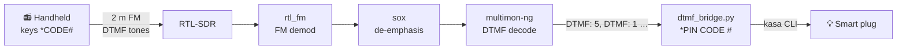
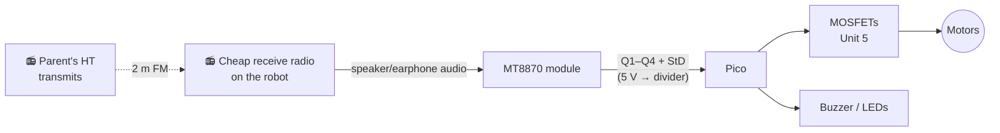

# Unit 12: Radio Remote

> Press buttons on a radio, and the lights in the house turn on. Then build a robot that
> drives by radio beeps.

**Sessions:** 5–6 · **Cost:** ~$40 (RTL-SDR, MT8870 module, cheap receive radio) · **Badges:** Signal Spotter, Coder, (new) 📶 Radio Operator
**Prerequisites:** Units 9 and 10. Builds on the parent's existing project in `~/infra/radio`.

## The existing system (the parent's project)

`~/infra/radio/dtmf_bridge.py`:
- A handheld keys a DTMF sequence on a 2 m simplex frequency.
- An RTL-SDR on a small home server hears it: `rtl_fm` → `sox` de-emphasis →
  `multimon-ng`.
- The bridge assembles `*<PIN><CODE>#` and runs a mapped command, e.g. a smart plug
  on or off.

This unit has the kids **use** it, **understand** it, **extend** it, and then **build their
own** decoder in hardware.

## 📜 Rules of the air

- **On ham bands, the kids transmit with the parent present as the control operator.**
  That's legal for unlicensed people under §97.115, using the parent's callsign. It's a
  great motivator for Unit 13's license.
- **ID with the callsign** at least every 10 minutes and at the end (§97.119), even on a
  "lights on" test.
- **No encryption or obscured messages** on ham (§97.113). A DTMF PIN is a gray area
  people debate. Plain command codes are fine. Know that *anyone* listening can see the
  codes, so the bridge should only control harmless things: lights, yes; door locks, no.
- **Keep your own frequency and command codes out of anything public** (like this site).
  Anyone who hears or reads them can replay them.
- **FRS (the license-free "walkie-talkie" radios):**
  - Part 95 is much narrower than Part 97. It allows tones "to make contact", but using FRS
    as a remote-control link is **at best a gray area**.
  - Read §95.531 and §95.533 before doing it. A stretch goal of having the bridge
    transmit replies on an FRS radio falls under the same question.
  - **Receiving** anything, anywhere, is fine for experiments.

## Part A: SDR safari (receive only, no license needed)

Plug the RTL-SDR into a laptop and go exploring. SDR++ or GQRX shows a live "waterfall"
of the spectrum.

| Listen to | Where | Tool | Wow factor |
|---|---|---|---|
| FM broadcast | 88–108 MHz | SDR++ | See every station as a stripe |
| NOAA Weather Radio | 162.400–162.550 MHz | SDR++ | Robot voice reading the weather |
| Airplanes | 1090 MHz ADS-B | `dump1090` / `tar1090` | **Live map of the planes overhead** |
| Weather stations, tire sensors, doorbells | 433.92 MHz | `rtl_433` | Neighbors' thermometers! |
| Our own HT | our simplex frequency | SDR++ | See our voice and the DTMF tones |

**8 y.o.:** planespotting. Match a plane on the map to one in the sky.
**11 y.o.:** decode `rtl_433` sensors, and figure out which one is ours.

## Part B: understand and extend the bridge

1. **What is DTMF?** Every key sends **two tones at once**, one from its row and one from
   its column:

   |  | 1209 Hz | 1336 Hz | 1477 Hz | 1633 Hz |
   |---|---|---|---|---|
   | **697 Hz** | 1 | 2 | 3 | A |
   | **770 Hz** | 4 | 5 | 6 | B |
   | **852 Hz** | 7 | 8 | 9 | C |
   | **941 Hz** | * | 0 | # | D |

   - Play DTMF on the Pico buzzer (Unit 9 `songs.py` with two notes alternated fast). It
     almost works. Why only almost? (Buzzers can't play two tones at once.)
   - Look at a real DTMF tone on the SDR waterfall: two lines.
2. **Hands-on:** the kids key the "light on" code on the handheld (the parent is the control operator and
   IDs). The workbench light comes on.
3. **Why the `sox` lowpass?** Read the comment in `dtmf_bridge.py`: FM pre-emphasis makes
   the high tones about 6 dB hot, so the decoder rejects some digits.
   - Demo it: disable `deemph` and see which digits fail. (The comment says `2`.)
   - A real debugging story, found by the parent. The kids should hear it.
4. **Extend it (11 y.o.):** add a command to the TOML config. Ideas:
   - a new code runs a script that plays a doorbell chime on a speaker.
   - another posts to a family chat, "Dad's on his way home".
   - A code that triggers the Unit 9 **Sentry** to arm (Pico W + HTTP).
5. **Read the tests** (`test_dtmf_bridge.py`): what the `Assembler` does with timeouts,
   and why the `Dispatcher` locks out after 3 bad PINs.

## Part C: build a hardware DTMF decoder + radio-controlled robot

This time, no computer. An **MT8870** DTMF decoder chip turns audio into a 4-bit number
plus a "got one!" strobe (StD).

**Robot key map** (a keypad is a joystick!):

|  |  |  |
|---|---|---|
| 1 spin left | **2 forward** | 3 spin right |
| **4 left** | **5 stop** | **6 right** |
| 7 | **8 back** | 9 |
| * horn | 0 | # dance |

**Build notes:**
- Get an MT8870 module (with a crystal, ~$3). It runs from 5 V.
  - Its **Q1–Q4 and StD outputs are 5 V logic**: put them through 1k/2k dividers to the
    Pico (Unit 9 lesson).
  - Or power the module from 3.3 V: the MT8870 is rated 4.75–5.25 V, so 3.3 V is outside
    spec and may be unreliable. Use dividers.
- **Audio in:** from the receive radio's earphone jack, through the module's input
  (it has a coupling cap and a gain resistor). Set the radio's volume to mid.
- **Chassis:** reuse the Unit 5 line follower's chassis and MOSFETs. The Pico now drives
  the gates.
- On the Pico, the code reads StD. On each rising edge, it reads Q1–Q4 as a number, then
  does the move.
  - The MT8870's codes: 1–9 = 1–9, **0 = 10**, * = 11, # = 12.
- **Safety:** the robot stops if no tone arrives for 1 s (a dead-man timer). The 11 y.o.
  should argue *why* before writing it.

> TODO: `code/radio_robot.py` (11 y.o. writes it with the parent; the structure mirrors
> `dtmf_bridge.py`'s `Assembler`, just simpler: one digit, one move).

## Jobs

| Step | 8 y.o. | 11 y.o. | Parent |
|---|---|---|---|
| SDR safari | Planespotter | `rtl_433` detective | Setup |
| Key the lights | Presses the keys (with the parent IDing) | Adds new codes | Control operator |
| DTMF decoder module | Solders the header pins and audio lead | Dividers, Pico code | |
| Radio robot | Drives it! Designs the obstacle course | Dead-man timer, key map | Transmits and IDs |

## Talk about it

- Anyone with a radio can hear our codes. Is that a problem? What should (and shouldn't)
  we control this way?
- Why does the robot need a "stop if you hear nothing" rule?
