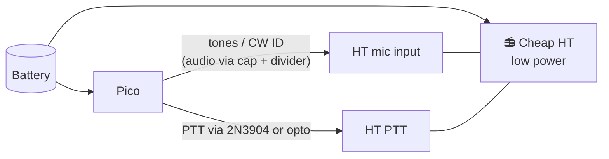

# Unit 13: License + Fox Hunt

> Both kids earn their own ham radio licenses. Then we build the gear to find a hidden
> transmitter, and go hunting.

**Sessions:** 6+ (license study runs in parallel with the other units) · **Cost:** ~$60 · **Badges:** 📻 Licensed, Radio Operator
**Prerequisites:** Unit 12 (and the motivation it creates!)

## Part A: Technician licenses

- **There's no minimum age.** Kids as young as 5 have passed. An 11 y.o. is very
  realistic; an 8 y.o. is realistic with enthusiasm.
- 35 questions from a public pool of about 400. Passing is 26 correct.
- The pool is published, so study it.

| Tool | How |
|---|---|
| **HamStudy.org** | Free flashcards with spaced repetition. 10–15 minutes a day. |
| ARRL *Ham Radio License Manual* | Explains the "why", so it's not just memorizing |
| This workshop | Units 1–12 already covered Ohm's law, resonance, antennas, and frequencies |
| Local club VE session | ARRL VEC, Laurel VEC, or GLAARG, some online. There's a small fee; many clubs waive it for kids. |

**Plan:**
- **11 y.o.:** HamStudy daily; aim for a practice-exam average of 85 % or more before
  booking.
- **8 y.o.:** start with the sections that connect to what they've built (safety,
  electrical principles, operating). Book the exam when their practice scores clear the
  pass mark consistently. **No pressure. It's okay to go second.**
- Celebrate each callsign on the day it appears in the FCC database.

## Part B: fox hunt gear

**Radio direction finding (RDF)**, also called fox hunting, T-hunting, or ARDF: someone hides a
transmitter (the "fox"), and hunters find it with directional antennas.

### 1. Tape-measure Yagi (both kids)

- The classic **WB2HOL** design: steel tape-measure elements on a PVC boom, 3 elements
  for 2 m.
- Get the exact dimensions and hairpin match from the original WB2HOL article (search
  "WB2HOL tape measure beam"). Don't trust copies with typos.
- **Tape-measure edges are sharp.** Cover the ends with tape or end caps. Gloves while
  cutting.

| Job | 8 y.o. | 11 y.o. | Parent |
|---|---|---|---|
| Cut PVC and tape | Measures, marks | Cuts the PVC | Cuts the tape (snips, gloves) |
| Assemble | Hose clamps | Hairpin match, solders the coax | Checks |
| Tune | | SWR with a NanoVNA | |

### 2. Offset attenuator (11 y.o.)

- Close to the fox, the signal is so strong it comes in from every direction and the Yagi
  can't point.
- An **offset attenuator** mixes the signal with a local oscillator, so you listen off
  frequency and turn a knob to weaken it smoothly by 100 dB or more.
- Design and kits: **homingin.com** (K0OV) has the details.
- A through-hole build that fits right after Unit 4.

### 3. The fox transmitter

- **Radio:** a cheap HT on low power. The controller keys its PTT and feeds audio.
- **Controller:** a Pico.
  - It plays a tune (Unit 9 `songs.py`!) for 20–30 s, then sends **the parent's callsign
    in Morse**, then rests.
  - Or buy a fox controller kit.
- **Legal:**
  - The fox must **ID at least every 10 minutes** (§97.119). Build the CW ID into the loop.
  - A licensed control operator is responsible for it the whole time.
  - Use a frequency your local club uses for T-hunts (**146.565 MHz is common in the US**;
    check your band plan).

## Part C: the hunt

1. **Backyard practice:** the parent hides the fox. The kids take turns: take a bearing,
   draw an arrow on a map, walk, take another bearing. Where the arrows cross is the fox.
2. **Park hunt:** bigger, with a timer. Swap roles: one kid hides the fox.
3. **Club hunt:** many ham clubs hold them. Kids who show up with a homemade Yagi get a
   *lot* of attention.

## Talk about it

- Why does the signal seem to come from everywhere when you're close?
- Rescuers find lost hikers' beacons and downed aircraft this way. How is our hunt the same?
