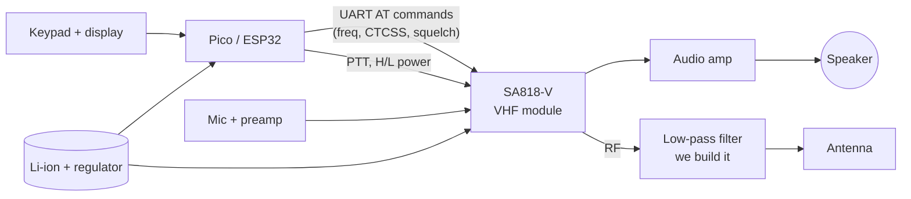

# Unit 15: Radio Capstone

> Build a real transceiver and talk to someone far away, on a radio we built.

**Sessions:** 6–10 · **Cost:** $60–150 · **Badges:** Tiny Parts, Signal Spotter, (new) 🌎 First Contact
**Prerequisites:** Unit 13 (licensed!), Units 6–8

Pick one track. Both are real radios.

## Track 1: HF kit transceiver (recommended first)

**QRP Labs QDX** (digital modes, FT8) or **QCX-mini** (CW).
- Excellent manuals, and a huge support community.
- Real contacts across the continent on 5 W.
- **License note:** a **Technician** has only narrow HF privileges: CW on parts of
  80/40/15 m, and CW, voice and data on part of 10 m. **FT8 on 20 or 40 m needs a
  General.**
  - So either the parent is the control operator on General-class frequencies,
  - or it's a great reason for the 11 y.o. to upgrade to General.

| Job | 8 y.o. | 11 y.o. | Parent |
|---|---|---|---|
| Parts inventory | Leads | | |
| Toroid winding (there are several) | **Winds them**: patient, counted work, just like the crystal radio coil | Checks the turn counts | |
| Soldering | Through-hole parts | Everything else | SMD rework if needed |
| Alignment and test | | Follows the manual, with a dummy load and the Unit 8 scope | Supervises RF |
| **First contact** | Logs it | Operates | Control operator if needed |

Simpler warm-up kits: the **4 State QRP Group Pixie or Cricket**, CW transceivers
that take about an afternoon.

## Track 2: homebrew 2 m handheld (SA818 module)

Everything except the RF core is ours.

- **The SA818-V** is a ~1 W VHF FM transceiver module, set up over UART with AT commands,
  e.g. `AT+DMOSETGROUP=...`.
  - **Use its datasheet** for the exact command format and supply range; the
    documentation varies between vendors.
- **The low-pass filter is not optional.** These modules are known for weak harmonic
  suppression.
  - Design a 5- or 7-pole LPF for 2 m with a filter calculator, and build it
    Manhattan-style or on an etched board.
  - **Verify it with a tinySA** (look for the harmonic at about 292 MHz) and a NanoVNA.
  - The rules require spurious emissions to meet **§97.307**. **Measure; don't assume.**
- **Case:** 3D printed, with the 8 y.o.'s design.
- **What it teaches:** everything. UARTs, audio, power, RF filtering, test equipment,
  and why commercial radios cost what they do.

## After the capstone

- Upgrade to a **General** license (the 11 y.o.).
- **Parks on the Air (POTA):** operate a homebuilt radio from a state park. Kids love
  it, and it's a family camping trip.
- **ARRL Kids Day**, and school club talks: "we built this".
