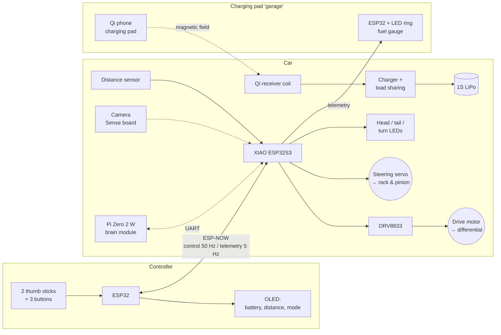
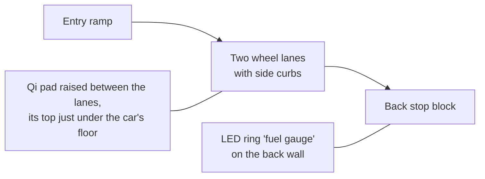
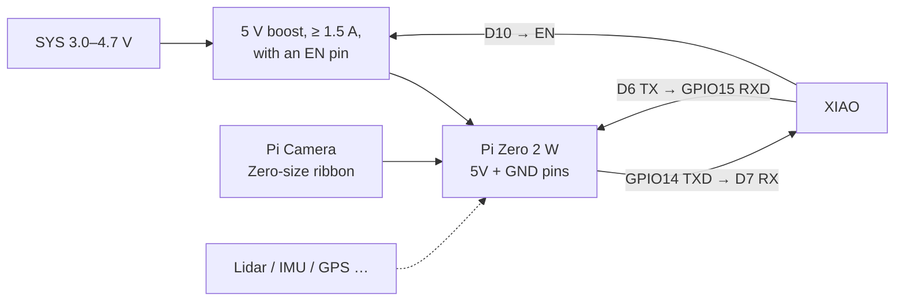

# Unit 16: Micro RC Cars

> A small RC car per kid, built from LEGO Technic and cheap modules, with real
> rack-and-pinion steering and a differential.
>
> - Park it on its **wireless charging pad** to recharge. No battery packs to pull out.
> - Plug-in modules add lights, a distance sensor, a camera, and a self-driving "robot"
>   mode.
> - The kids build the controller too.

**Sessions:** 10–14 (spread over weeks) · **Cost:** ~$40–70 per car, ~$20 controller, ~$20 pad · **Badges:** Tiny Parts, Coder, Heat Manager, (new) 🏎️ Pit Crew
**Prerequisites:** Units 9 (Pico/ESP basics), 10 (servos), 11 (Li-ion safety). Unit 5 (MOTOR switching) and 12 (radio ideas) help.

Commercial kits like this exist, but they cost a lot and hide the interesting parts. Here
every block is something we've already met in an earlier unit, now combined.

## The system

- **ESP-NOW** is Espressif's router-free, low-latency radio link.
- **Broadcast plus a car ID** means several cars and controllers share the air without
  pairing: controller #2 drives car #2 only.

---

## Part 1: chassis (no 3D printing)

| Option | Steering | Differential | Motor coupling | Good for |
|---|---|---|---|---|
| **A. LEGO Technic** (recommended) | Technic gear rack + 8-tooth pinion + steering knuckles | Technic differential with 3 bevel gears inside | **GeekServo** motor and servo: they have LEGO cross-axle outputs and pin holes | Kids redesign it endlessly. Nothing is glued. |
| B. Thrift-store toy RC car as a donor | Keep it if it's proportional (a servo, or a motor + pot). Many cheap cars use "bang-bang" magnet steering, which you replace with a servo and a paperclip linkage. | Usually present | Keep the car's own motor and gearbox | Fastest start; teaches reverse engineering |
| C. Hardware-store scratch build | Plastic M0.5 gear rack + pinion strips, brass tube kingpins | Skip it, and use **two motors** as an "electronic differential" (twist!) | N20 gear motors, zip ties, hot glue | Plywood or aluminum-flat-bar chassis fans |

### Getting LEGO parts cheaply

- A used **Technic car set**, or bulk Technic sold by the pound (thrift stores, eBay,
  Facebook Marketplace), usually already contains a steering rack, knuckles, and a
  differential.
- Missing pieces cost cents each on **BrickLink** or **LEGO Pick a Brick**. Search
  "Technic differential", "Technic gear rack", "Technic steering".
- **Kids should design the chassis themselves.** The rules:
  1. Steering servo → pinion → rack → both front wheels.
  2. Drive motor → gear down (e.g. 8T driving 24T, 3:1) → differential → rear wheels.
  3. Leave a **flat, open area under the floor** for the Qi receiver coil. The coil is a
     thin disc about 40–50 mm across.
  4. Keep the battery **away from the coil** (at least 1 cm up). Metal near the coil
     heats up.

**GeekServo (Kittenbot) parts:**
- a 9 g-class **servo** (270° or 360° versions)
- a **DC gear motor**

Both have LEGO-compatible cross-axle outputs and Technic pin mounting holes. Check the
listing for the voltage range; they're sold for 3.3–6 V builds.

**Twist: the electronic differential (option C, or a level-up for A).**
- Drive each rear wheel with its own N20 motor, using both channels of the DRV8833.
- The firmware slows the inside wheel in turns, which is what a mechanical differential
  does, and more.
- It's a great 11 y.o. lesson: *what does a differential actually do?* Take the LEGO
  one apart and watch the bevel gears.

### Scale check

A LEGO Technic car with an ESP32 board and a small LiPo lands around **15–20 cm long**,
closer to 1:18 than a 1:28 Mini-Z. That's fine, and easier for small hands to build and
fix. For truly tiny (option C with N20s and a XIAO), about 10 cm is doable.

---

## Part 2: car electronics

### Parts per car

| Qty | Part | ~$ | Notes |
|---|---|---|---|
| 1 | **Seeed XIAO ESP32S3**, or the **XIAO ESP32S3 Sense** (adds a camera and microSD) | 8 / 14 | Thumb-sized. The Sense is only needed for the camera stage. |
| 1 | DRV8833 dual H-bridge breakout | 2 | 2.7–10.8 V, happy on 1S. One channel for the drive motor; both for the electronic differential. |
| 1 | GeekServo DC motor, or an N20 gear motor (~300 RPM at 6 V) | 5 | |
| 1 | GeekServo or SG90 micro servo | 4 | Steering |
| 1 | 1S LiPo, 500–1000 mAh, **with a protection circuit** | 6 | |
| 1 | TP4056 USB-C charger board **with DW01 protection** (6-pin: IN, OUT, B) | 1 | Set the charge current. See the power section. |
| 1 | Qi receiver patch (the kind sold to add wireless charging to old phones; 5 V out) | 4 | |
| 1 | AO3401 P-MOSFET (SOT-23), SS14 Schottky, 3 × 100 kΩ + 2 × 100 kΩ | 1 | Load sharing and sensing. **Tiny Parts** badge material. |
| 1 | Slide switch | 0.5 | Main power |
| 4 | WS2812B LEDs (on a strip you can cut, or as single "pixels") | 1 | 2 front, 2 rear |
| 1 | VL53L1X laser distance sensor (I2C), **or** an RCWL-1601 ultrasonic (a 3.3 V HC-SR04 twin) | 5 / 3 | The laser one is tiny and good on small cars. The ultrasonic continues Unit 9. |
| — | JST-PH 2.0 mm connectors, perfboard, hookup wire | 3 | The module ports |

### Module ports: the "standard plug" idea

The car's main board is perfboard, or an etched board (Unit 6), with the XIAO in the
middle and **keyed JST-PH sockets** around the edge. Every add-on is a module with a
matching plug, so kids can swap and invent modules without re-soldering the car.

| Port | Pins | XIAO pins | Used by |
|---|---|---|---|
| **DRIVE** | 2 (motor + / −) | D0, D1 → DRV8833 AIN1/AIN2 | Drive motor |
| **DRIVE2** | 2 | D6, D7 → DRV8833 BIN1/BIN2 | Second motor (electronic differential). Needs firmware changes. Uses the SONAR/BRAIN pins, so a two-motor car uses the VL53L1X and no brain, unless you add an I2C GPIO expander. |
| **STEER** | 3 (SYS, GND, signal) | D2 | Steering servo |
| **LIGHTS** | 3 (SYS, GND, data) | D3 | WS2812 chain: 0 = front-left, 1 = front-right, 2 = rear-left, 3 = rear-right |
| **I2C** | 4 (3V3, GND, SDA, SCL) | D4, D5 | VL53L1X, or later an IMU or a small OLED. Same order as Qwiic/STEMMA QT, so those modules fit with an adapter cable. |
| **SONAR** | 4 (3V3, GND, TRIG, ECHO) | D6, D7 | RCWL-1601 ultrasonic |
| **BRAIN** | 4 (EN, GND, TX, RX) | D10 (5 V boost enable), D6 → Pi RXD, D7 ← Pi TXD | Pi Zero 2 W brain module (Part 6). It **shares D6/D7 with SONAR**, so a brain car uses the VL53L1X. |
| **CHARGE** | 2 | — | Qi receiver patch → charger board |
| (internal) | — | D8, D9 | Battery voltage and charge-detect dividers |

**Camera:** on the XIAO ESP32S3 Sense, the camera is a clip-on board with its own
connector, so it uses **none** of D0–D10.

### Power path and wireless charging

**Why the "load sharing" parts?**

- A TP4056 decides the battery is full when the charge current drops low.
- If the car's electronics are drawing current from the battery at the same time, the
  charger never sees that drop. It can keep charging forever, which is bad for a LiPo.
- The Schottky + P-MOSFET pair fixes this. On the pad, the car runs from the pad's 5 V
  and the battery is **only** being charged. Off the pad, the MOSFET switches the battery
  back in automatically.
- Explaining this is a great 11 y.o. exercise.

**Two traps with these modules:**
- **The protected ground is OUT− / IN−, not B−.** The DW01 protection switch sits in the
  negative lead. If you connect the car's ground to B−, you bypass the protection.
- **Charge current** is set by the board's R_PROG resistor: I ≈ 1200 / R_PROG(kΩ) mA.

| R_PROG | Charge current | Use with |
|---|---|---|
| 1.2 kΩ (usual default) | ~1 A | ≥ 1000 mAh cell, and only if the Qi patch can supply it |
| 2.4 kΩ | ~500 mA | 500–1000 mAh (recommended) |
| 4.7 kΩ | ~250 mA | Small cells, or a weak Qi patch |

**Realistic numbers:**
- Qi links are roughly 50–70 % efficient.
- A 600 mAh cell at 500 mA takes about 1.5 h from empty.
- Driving time is about 20–40 minutes, depending on the motor.

### The charging "garage"

Qi only works when the coils are **close (a few mm) and lined up (within ~5–10 mm)**. So
the pad is built into a little garage that lines the car up for you:

- **Side curbs** (wood strips, or LEGO) center the car left to right.
- The **back stop** sets front to back. Drive in until you touch it.
- The **Qi pad sits in the middle**, raised on shims so the car's coil ends up about
  2–4 mm above it. Fine-tune the height with cardstock shims and watch the charge-detect
  LED.
- **Use a real, certified Qi phone charging pad.** Those detect foreign metal objects and
  refuse to heat a coin or a key. The bare "wireless power module" coil pairs sold online
  often don't have that protection.

**How you know it's charging:**
- The **car's 4 lights become a battery gauge**: green bars filling up, with the top one
  pulsing.
- The **pad's LED ring** (`firmware/pad/`) shows the same level, big enough to see
  across the room.
- The **controller's OLED** shows `CHARGING` and the percentage.

**Plan B, if the Qi alignment is too fiddly: contact charging.**
- Copper-tape rails on the garage floor, with spring contacts on the car. This is how
  robot vacuums dock.
- It's cheaper and more efficient, and still means no unplugging.
- The load-sharing circuit is identical. Only the 5 V source changes.

### ⚠️ Battery safety

The Unit 11 rules apply.
- Protected cells only.
- Charge while someone's home.
- A puffy cell gets retired.
- Car crashes are **impact tests** for the battery: mount it in the middle of the chassis,
  padded with foam tape, never at the bumper.

---

## Part 3: the controller

The kids build this from scratch.

| Part | Notes |
|---|---|
| ESP32 devkit (classic ESP32-WROOM-32) | Any ESP32 works for ESP-NOW |
| 2 × thumb-joystick modules (KY-023 style) | **Power them from 3.3 V**, not 5 V |
| 3 pushbuttons | MODE, LIGHTS, CAR # |
| SSD1306 128×64 I2C OLED | Telemetry display |
| 18650 cell + holder + TP4056/protection + boost to 5 V, or 3×AA | The same power skills as Unit 11 |
| Enclosure | Plywood box, a cigar box, a mint tin, or LEGO |

**Wiring** is at the top of [`firmware/controller/controller.ino`](firmware/controller/controller.ino).

**Important:** the sticks must use **ADC1 pins (GPIO32–39)**. ADC2 stops working
whenever the radio is on.

**Controls:**
- Left stick up and down = throttle. Right stick left and right = steering.
- **MODE** cycles through **DRIVE**, **SAFE** and **ROBOT** (explained below).
- **LIGHTS** toggles the lights.
- **CAR #** picks which car this controller drives (remembered after power-off).

---

## Part 4: firmware

| Sketch | Board | Libraries |
|---|---|---|
| [`firmware/car/car.ino`](firmware/car/car.ino) | XIAO ESP32S3 | Adafruit NeoPixel, Pololu VL53L1X |
| [`firmware/controller/controller.ino`](firmware/controller/controller.ino) | ESP32 Dev Module | Adafruit SSD1306, Adafruit GFX |
| [`firmware/pad/pad.ino`](firmware/pad/pad.ino) | Any ESP32 (C3 SuperMini is great) | Adafruit NeoPixel |

- **Core:** Arduino IDE or `arduino-cli` with the **esp32 core 3.x** (Espressif).
- **Shared protocol:** each sketch folder has an identical `protocol.h` (the packet
  formats). After editing one, copy it to the others. `tools/check_protocol.sh` checks
  they match.
- **Before the first drive, set in `car.ino`:**
  - `CAR_ID`
  - `USE_TOF` (1 = laser distance sensor, 0 = ultrasonic)
  - `STEER_CENTER_US`: trim until the car tracks straight
  - `STEER_RANGE_US`: stop just before the rack hits its ends

### Drive modes

| Mode | Name on the OLED | What the car does |
|---|---|---|
| `MODE_MANUAL` | DRIVE | You drive. Throttle is capped at `MAX_THROTTLE` (start at 50–80 % for the 8 y.o.). |
| `MODE_AVOID` | SAFE | You drive, but the car **refuses to go forward** within 25 cm of an obstacle and flashes its hazards. Reverse still works. |
| `MODE_AUTO` | ROBOT | The car drives itself. It cruises, and when something is within 40 cm it does a **3-point turn**, alternating sides. Pull the throttle stick back to stop it. |
| `MODE_BRAIN` | BRAIN | The Pi brain module drives (Part 6). **Any stick movement overrides it instantly.** The car stops if the Pi goes quiet for 300 ms. |

### Built-in safety

- **Failsafe:** no packet for 400 ms → the motor stops and the hazards flash. Turn the
  controller off mid-drive and the car stops by itself. *Test this first!*
- **Low battery** (< 3.45 V): half speed plus hazards. "Limp home to the pad."
- **Throttle ramping** protects the LEGO gears from sudden reversal.
- On the pad, **driving is disabled**.

### The lights are automatic

- **Headlights** when lights are on.
- **Brake lights** when slowing or reversing.
- **Turn signals** on hard steering.
- **Hazards** on failsafe, low battery, or a SAFE-mode stop.

The 8 y.o. can own the light patterns: colors and blink rates are easy, safe code edits.

---

## Part 5: camera (Sense board)

1. **First, alone:** flash Espressif's `CameraWebServer` example
   (File → Examples → ESP32 → Camera) with the XIAO ESP32S3 Sense camera model selected.
   Open the stream on a phone or laptop.
2. **Mount it** on the car's nose with a LEGO hinge, so the tilt is adjustable.
3. **Combine** it with `car.ino` (an 11 y.o. + parent project):
   - The camera needs WiFi (join the home network, or have the car be an access point),
     and ESP-NOW has to share that radio.
   - **All three devices must use the same WiFi channel.** Set `WIFI_CHANNEL` in
     `protocol.h` to the AP's channel.
   - Expect ~100–300 ms of video lag. That's fine for exploring, but drive slowly
     "first-person".

**Level-up:** stream to a laptop, find a colored ball with OpenCV, and send steering
commands back. The car chases the ball.

---

## Part 6: brain module (Raspberry Pi Zero 2 W)

The XIAO is great at real-time jobs, but too small for computer vision, lidar, or heavy
math. So the brain rides on the car as one more **module**:

| Job | Done by |
|---|---|
| Motors, steering, radio link, lights, **every failsafe** | XIAO: the "spinal cord" |
| Camera vision (OpenCV), lidar, IMU, planning, logging, a web dashboard | Pi: the "brain" |

- The Pi only **suggests** throttle and steering over a serial line. The XIAO decides
  whether to obey.
- If the Pi crashes, hangs, or is still booting, the car just stops. The controller must
  stay on as the dead-man switch, and any stick movement overrides the brain.

**Zero 2 W vs the original Zero W:** use the **Zero 2 W**. It's the same size and
connectors, but quad-core and about 5× faster, which is the difference between OpenCV
being usable and not. The original Zero W works for lighter jobs (logging, a dashboard,
a few frames per second).

### Wiring and power

- **The Pi needs a steady 5 V.** Use a boost converter from SYS with an **enable pin**,
  e.g. a Pololu U3V16F5 or any boost board with EN. That lets the XIAO power the Pi down.
- Both boards are 3.3 V logic, so the UART wires connect directly.
- **Bigger battery:** the Pi draws about 0.3–0.6 A at 5 V (≈ 0.5–1 A from the cell).
  Move to a 1500–2000 mAh 1S pack. Expect about 45–90 min of driving.
- **On the pad:** the Pi plus the charger both draw from the Qi patch, which gives ~1 A
  at best. Set R_PROG to 4.7 kΩ (250 mA), or have the brain idle while it charges.
- **Shutting down safely:** cutting power to a running Pi can corrupt its SD card.
  - When the battery stays below 3.5 V for 5 s, the XIAO sends `S`. `carlink.py` runs
    `shutdown`, and the XIAO cuts the boost 20 s later.
  - Also turn on Raspberry Pi OS's **read-only overlay file system** (`raspi-config` →
    Performance). Then a surprise power cut can't hurt the card.

### Pi setup

1. Flash **Raspberry Pi OS Lite (64-bit)**. Set WiFi, SSH and a user in Raspberry Pi
   Imager.
2. `sudo raspi-config`: Interface → Serial Port → login shell **No**, hardware **Yes**.
3. In `/boot/firmware/config.txt`, add `dtoverlay=disable-bt`. That gives `/dev/serial0`
   the good UART (PL011) instead of the mini-UART, whose baud rate drifts with the CPU
   clock.
4. `sudo apt install python3-opencv python3-picamera2 python3-serial`
5. Copy [`brain/`](brain/) to the Pi. On the car, set `HAS_BRAIN 1` in `car.ino` and
   reflash it.

### The code ([`brain/`](brain/))

| File | What |
|---|---|
| `carlink.py` | The serial protocol: `drive(throttle, steer)`, `telemetry` (battery, distance, charging, mode), and the shutdown request. `test_carlink.py` tests it on any computer. |
| `camera.py` | Frames from the Pi camera as OpenCV images |
| `line_follow.py` | **Demo 1:** follow black tape with the camera (PD steering). The same idea as Unit 5, but the "sensor" is 76,800 pixels. |
| `dock.py` | **Demo 2, self-parking:** find the ArUco marker on the garage wall, drive in, creep the last bit, and stop when the car reports **charging**. |
| `make_marker.py` | Prints the ArUco marker for the garage wall |

**Self-parking** closes the loop on the whole project: *drive around → battery low → it
parks itself on the charger*. The 11 y.o. can combine `dock.py` with the battery
telemetry: "if battery < 30 %, go dock".

### What else the brain opens up

- **2D lidar** (LDRobot LD06/LD19 class, ~$70–100): a 360° distance scan. Map the room
  and plan paths.
  - Connect it through a USB-serial adapter on the Zero's USB port, since the UART
    belongs to the XIAO.
- **IMU** (BNO055, MPU-6050) on the Pi's I2C: heading, and detecting crashes and flips.
- **Web dashboard:** a live camera feed plus telemetry graphs on a phone, served by the Pi.
- **Machine learning:** TensorFlow Lite object detection at a few frames per second on a
  Zero 2 W. Stop signs made from LEGO!
- **Logging:** record every drive (telemetry + video). Then replay it and discuss what the
  robot "saw".

## Jobs

| Step | 8 y.o. | 11 y.o. | Parent |
|---|---|---|---|
| Chassis design | **Designs and builds the LEGO chassis** | Gear ratio math, steering geometry | Checks the rack doesn't bind |
| Motor and servo mounting | Mounts the GeekServo parts | Centers the servo with the Unit 10 tester before attaching the pinion | |
| Car main board | Solders the JST sockets and the switch | Solders the XIAO headers, DRV8833, dividers; the MOSFET and Schottky (**Tiny Parts**) | Power path check with the bench supply, **before** a battery goes in |
| Charger + Qi patch | | Wires it; sets R_PROG | **Battery connection** |
| Garage | Builds it (wood or LEGO), paints it, adds the LED ring | Tunes the pad height with shims | Qi pad choice |
| Controller | Buttons, box, labels | Sticks, OLED, firmware flash | |
| Firmware | Changes light colors, `MAX_THROTTLE`, car name/ID | Trims steering, tunes the avoid distances, writes new auto behaviors | Code review |
| Test day | Obstacle course designer | Failsafe test | Referee |

## Suggested session plan

1. **Chassis:** steering and drive by hand, no electronics. Does it roll straight? Does the
   diff work? (Lift a wheel and spin the other.)
2. **Motor + servo on the bench supply:** XIAO + DRV8833 + servo on a breadboard, driven
   from a USB serial test sketch.
3. **Controller:** build it, flash it, watch the OLED numbers change.
4. **First drive,** powered **from the bench supply through long thin wires** (current
   limit 1 A). There's no battery risk yet.
5. **Power path:** build the charger and load-sharing on the bench and **measure it before
   connecting the LiPo** (below).
6. **Battery in; first untethered drive.** Then the failsafe test.
7. **Lights module.**
8. **Distance module;** SAFE and ROBOT modes.
9. **Garage + Qi.** Tune the alignment.
10. **Pad LED ring;** first "drive in, watch it charge, drive out".
11. **Camera** (optional).
12. **Race day:** both kids' cars, lap timing, an obstacle course.

## Power path bench test (before any LiPo is connected)

Use the Unit 7 supply in place of the battery (3.7 V, 200 mA limit) and a USB 5 V source
in place of the Qi patch.

| Test | Expect |
|---|---|
| "Battery" only | SYS ≈ 3.7 V (through the MOSFET); D9 reads LOW |
| 5 V applied | SYS ≈ 4.6–4.7 V (through the Schottky); D9 HIGH; the MOSFET gate is at 5 V, so it's off |
| 5 V applied, SYS loaded with 100 Ω | The supply standing in for the battery shows **no** current flowing out of it into SYS |
| D8 | ≈ half the "battery" voltage |

## Troubleshooting

| Symptom | Likely cause | Check |
|---|---|---|
| Car doesn't respond | Wrong `CAR_ID`, or a channel mismatch | Controller OLED says "no signal"; compare `CAR_ID` with the CAR # |
| Stutters, resets when the motor starts | Battery sag or motor noise browning out the XIAO | 470 µF across SYS; 100 nF across the motor terminals; twist the motor wires |
| Steering pulls to one side | Servo not centered | `STEER_CENTER_US` |
| Servo buzzes at full lock | The rack is at its end stop | Reduce `STEER_RANGE_US` |
| Never shows CHARGING on the pad | The coils are too far apart or not lined up | Shim the pad up; measure VIN on the car |
| Charges, but never reaches 100 % / TP4056 never shows "full" | Load sharing isn't working | Measure the MOSFET gate on the pad: it should be ≈ 5 V |
| Pad or car coil gets hot | Metal near the coil (screws, battery) | Move the battery up; nylon screws near the coil |
| Distance always "--" | Sensor not found (I2C), or the wrong `USE_TOF` | Serial monitor at boot |
| Controller sticks drift | Center calibrated while a stick was touched | Power-cycle hands-off |
| BRAIN mode just flashes hazards | The Pi isn't sending `C` lines (still booting, the script isn't running, or the UART isn't set up) | On the Pi: `python3 -c "from carlink import CarLink; import time; c=CarLink(); time.sleep(1); print(c.telemetry)"` |
| Garbled serial | The mini-UART is active | `dtoverlay=disable-bt`, then reboot |

## Level-ups

- **Electronic differential** with two motors.
- **Line following:** a Unit 5 TCRT5000 pair as a module on the I2C port (through an
  ADS1115) or on spare pins.
- **Lap timer:** an IR beam across the track (Unit 3's timing gate), reporting to the pad
  over ESP-NOW. The pad's ring flashes the winner's color.
- **Self-parking:** in ROBOT mode, when the battery is low, find the garage. (Hard!
  Needs a beacon: an IR LED on the garage, or a colored target plus the camera.)
- **Horn/sound module:** a small buzzer on a spare pin. Unit 9's `songs.py` ideas, ported
  to C++.
- **Radio remote tie-in:** the Unit 12 DTMF bridge could "call" a car home.

## Talk about it

- The car stops when it loses the controller. Why is that the right choice? What do real
  self-driving cars do?
- Why is charging without plugging in less efficient? Where does the missing energy go?
- A mechanical differential and an "electronic" one do the same job. Which is better, and
  why do real cars use both?
